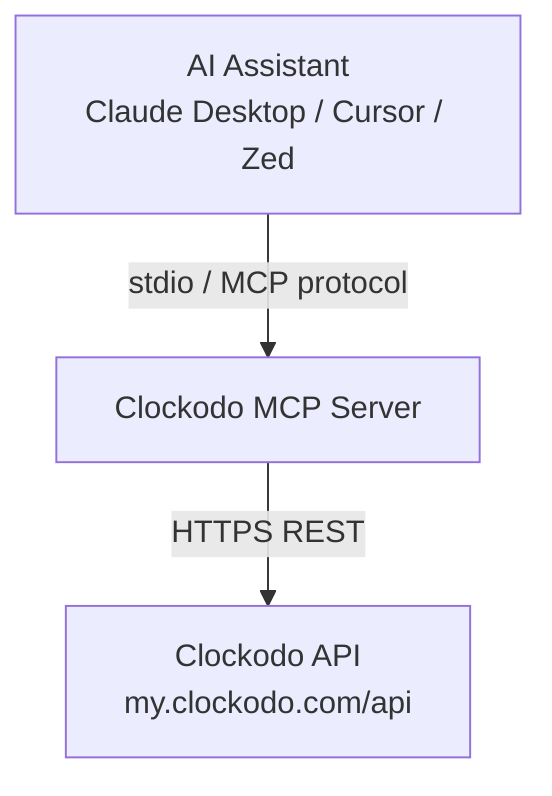
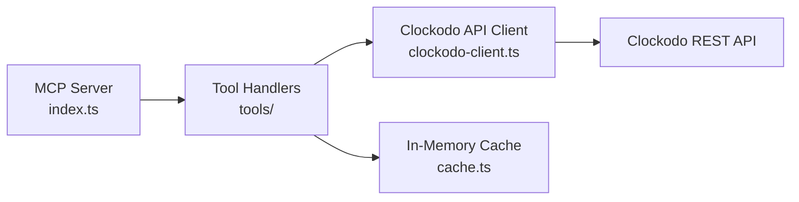
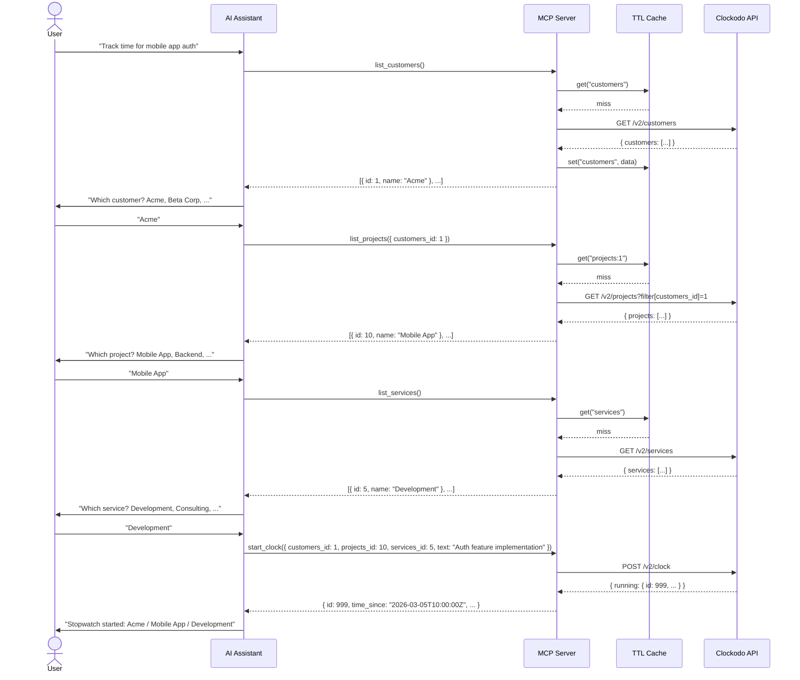

# Solution Design Document

## Validation Checklist

### CRITICAL GATES (Must Pass)

- [x] All required sections are complete
- [x] No [NEEDS CLARIFICATION] markers remain
- [x] Architecture pattern is clearly stated with rationale
- [x] **All architecture decisions confirmed by user**
- [x] Every interface has specification

### QUALITY CHECKS (Should Pass)

- [x] All context sources are listed with relevance ratings
- [x] Project commands are discovered from actual project files
- [x] Constraints → Strategy → Design → Implementation path is logical
- [x] Every component in diagram has directory mapping
- [x] Error handling covers all error types
- [x] Quality requirements are specific and measurable
- [x] Component names consistent across diagrams
- [x] A developer could implement from this design

---

## Constraints

CON-1 **Language/Runtime**: TypeScript + Node.js — required for best MCP SDK support via `@modelcontextprotocol/sdk`.
CON-2 **Transport**: stdio only — server runs locally, communicates with Claude Desktop / IDE extensions.
CON-3 **Authentication**: Clockodo API key + email via HTTP headers. Credentials stored in environment variables, never logged.
CON-4 **Rate limits**: Clockodo allows max 900 requests/minute per user. Caching required for list endpoints.
CON-5 **API versions**: Use current stable Clockodo API endpoints (v2 for clock, v2 for customers/projects/services). Monitor May 2026 deprecation.
CON-6 **Single user**: One authenticated Clockodo user per server instance.

## Implementation Context

### Required Context Sources

#### Documentation Context
```yaml
- doc: .start/specs/001-clockodo-mcp-server/requirements.md
  relevance: CRITICAL
  why: "PRD defines all features and acceptance criteria"

- url: https://docs.clockodo.com/openapi.yaml
  relevance: CRITICAL
  why: "Clockodo API schema — all endpoints, fields, types"

- url: https://modelcontextprotocol.io/docs/sdk
  relevance: HIGH
  why: "MCP TypeScript SDK documentation and patterns"
```

#### Code Context
```yaml
- file: package.json
  relevance: HIGH
  why: "Dependencies and build scripts (to be created)"
```

#### External APIs
```yaml
- service: Clockodo REST API
  doc: https://docs.clockodo.com/
  relevance: CRITICAL
  why: "All time tracking operations go through this API"
```

### Implementation Boundaries

- **Must Preserve**: Nothing — greenfield project
- **Can Modify**: Everything — new codebase
- **Must Not Touch**: N/A

### External Interfaces

#### System Context Diagram



#### Interface Specifications

```yaml
# Inbound Interfaces
inbound:
  - name: "MCP Client"
    type: stdio
    format: JSON-RPC (MCP protocol)
    authentication: None (local process)
    data_flow: "Tool calls and results"

# Outbound Interfaces
outbound:
  - name: "Clockodo REST API"
    type: HTTPS
    format: REST / JSON
    authentication: "X-ClockodoApiUser + X-ClockodoApiKey headers"
    data_flow: "CRUD operations on time entries, read operations on customers/projects/services"
    criticality: CRITICAL
```

### Project Commands

```bash
# Core Commands
Install: npm install
Dev:     npm run dev          # ts-node with watch
Test:    npm test             # vitest
Lint:    npm run lint         # eslint
Build:   npm run build        # tsc
Start:   node dist/index.js   # production entry point
```

## Solution Strategy

- **Architecture Pattern**: Flat modular — single-process MCP server with a thin API client layer. No need for layered architecture given the small scope (6 tools, 1 external API).
- **Integration Approach**: The MCP server wraps the Clockodo REST API. Each MCP tool maps to one or more Clockodo API calls. An in-memory cache (5-minute TTL) reduces redundant API calls for list endpoints.
- **Justification**: A flat structure keeps the codebase small and readable. The server is a thin translation layer between MCP protocol and Clockodo REST API — no complex business logic, no database, no multi-tenancy.
- **Key Decisions**: Tools only (no MCP Prompts), custom fetch wrapper (no third-party Clockodo SDK), in-memory cache for lists.

## Building Block View

### Components



| Component | Responsibility |
|-----------|---------------|
| **MCP Server** (`index.ts`) | Registers tools, connects stdio transport, starts server |
| **Tool Handlers** (`tools/`) | Validates inputs, calls API client, formats MCP responses |
| **Clockodo API Client** (`clockodo-client.ts`) | HTTP requests to Clockodo API, auth headers, pagination, error mapping |
| **In-Memory Cache** (`cache.ts`) | TTL-based cache for list responses (customers, projects, services) |

### Directory Map

```
clockodo-mcp/
├── src/
│   ├── index.ts                    # NEW: MCP server entry point
│   ├── clockodo-client.ts          # NEW: Clockodo REST API client
│   ├── cache.ts                    # NEW: In-memory TTL cache
│   └── tools/
│       ├── list-customers.ts       # NEW: list_customers tool handler
│       ├── list-projects.ts        # NEW: list_projects tool handler
│       ├── list-services.ts        # NEW: list_services tool handler
│       ├── start-clock.ts          # NEW: start_clock tool handler
│       ├── stop-clock.ts           # NEW: stop_clock tool handler
│       └── get-running-entry.ts    # NEW: get_running_entry tool handler
├── test/
│   ├── clockodo-client.test.ts     # NEW: API client tests
│   ├── cache.test.ts               # NEW: Cache tests
│   └── tools/
│       ├── list-customers.test.ts  # NEW: Tool handler tests
│       ├── list-projects.test.ts
│       ├── list-services.test.ts
│       ├── start-clock.test.ts
│       ├── stop-clock.test.ts
│       └── get-running-entry.test.ts
├── package.json                    # NEW: Project config
├── tsconfig.json                   # NEW: TypeScript config
└── .env.example                    # NEW: Env var template
```

### Interface Specifications

#### MCP Tool Definitions

**Tool: `list_customers`**
```yaml
Input: {}  # No required parameters
Output:
  content:
    - type: text
      text: "JSON array of { id, name, active }"
```

**Tool: `list_projects`**
```yaml
Input:
  customers_id: integer (optional) — filter by customer
Output:
  content:
    - type: text
      text: "JSON array of { id, name, customers_id, customer_name, active }"
```

**Tool: `list_services`**
```yaml
Input: {}  # No required parameters
Output:
  content:
    - type: text
      text: "JSON array of { id, name, active }"
```

**Tool: `start_clock`**
```yaml
Input:
  customers_id: integer (required, minimum 1)
  services_id: integer (required, minimum 1)
  projects_id: integer (optional)
  text: string (optional, max 1000 chars) — entry description
Output:
  content:
    - type: text
      text: "JSON { id, customers_id, projects_id, services_id, text, time_since }"
```

**Tool: `stop_clock`**
```yaml
Input:
  entry_id: integer (required) — ID of running entry to stop
Output:
  content:
    - type: text
      text: "JSON { id, time_since, time_until, duration }"
```

**Tool: `get_running_entry`**
```yaml
Input: {}  # No required parameters
Output:
  content:
    - type: text
      text: "JSON { running: { id, customers_id, projects_id, services_id, text, time_since } | null }"
```

#### Clockodo API Client Interface

```typescript
interface ClockodoClient {
  // List endpoints (cached)
  listCustomers(): Promise<Customer[]>
  listProjects(customersId?: number): Promise<Project[]>
  listServices(): Promise<Service[]>

  // Clock endpoints (never cached)
  getRunningEntry(): Promise<Entry | null>
  startClock(params: StartClockParams): Promise<Entry>
  stopClock(entryId: number): Promise<StoppedEntry>
}

interface Customer {
  id: number
  name: string
  active: boolean
}

interface Project {
  id: number
  name: string
  customers_id: number
  active: boolean
}

interface Service {
  id: number
  name: string
  active: boolean
}

interface Entry {
  id: number
  customers_id: number
  projects_id: number | null
  services_id: number
  text: string | null
  time_since: string       // ISO 8601 UTC
  time_until: string | null
  duration: number          // seconds
}

interface StartClockParams {
  customers_id: number
  services_id: number
  projects_id?: number
  text?: string
}

interface StoppedEntry extends Entry {
  time_until: string
}
```

#### Data Storage Changes

No database. No persistent storage. In-memory TTL cache only (cleared on server restart).

#### Internal API Changes

N/A — this is a new standalone server, not modifying an existing application.

#### Application Data Models

See ClockodoClient interface above — data models mirror Clockodo API response shapes with only the fields relevant to our tools.

#### Integration Points

```yaml
# External System Integration
Clockodo REST API:
  base_url: https://my.clockodo.com/api
  auth_headers:
    X-ClockodoApiUser: "${CLOCKODO_EMAIL}"
    X-ClockodoApiKey: "${CLOCKODO_API_KEY}"
    X-Clockodo-External-Application: "clockodo-mcp;${CLOCKODO_EMAIL}"
  endpoints_used:
    - GET /v2/customers  (list active customers, paginated)
    - GET /v2/projects   (list active projects, filtered by customers_id)
    - GET /v2/services   (list active services)
    - GET /v2/clock      (get running entry)
    - POST /v2/clock     (start clock)
    - DELETE /v2/clock/{id} (stop clock)
  rate_limits:
    per_minute: 900
    per_15min: 2250
    per_hour: 4500
    per_day: 20000
```

### Implementation Examples

#### Example: Clockodo API Client — Paginated List Fetch

**Why this example**: List endpoints use pagination. Missing pagination handling would silently return incomplete data.

```typescript
async function fetchAllPages<T>(
  path: string,
  dataKey: string,
  params?: Record<string, string>
): Promise<T[]> {
  const results: T[] = [];
  let page = 1;

  while (true) {
    const url = new URL(`${BASE_URL}${path}`);
    url.searchParams.set("page", String(page));
    if (params) {
      for (const [key, value] of Object.entries(params)) {
        url.searchParams.set(key, value);
      }
    }

    const response = await fetch(url.toString(), {
      headers: {
        "X-ClockodoApiUser": config.email,
        "X-ClockodoApiKey": config.apiKey,
        "X-Clockodo-External-Application": `clockodo-mcp;${config.email}`,
      },
    });

    if (!response.ok) {
      throw new ClockodoApiError(response.status, await response.text());
    }

    const body = await response.json();
    results.push(...body[dataKey]);

    // Stop when we've fetched all pages
    if (page >= body.paging.count_pages) break;
    page++;
  }

  return results;
}
```

#### Example: In-Memory TTL Cache

**Why this example**: Cache invalidation logic is subtle — must handle TTL expiry and manual invalidation for tests.

```typescript
class TtlCache {
  private store = new Map<string, { data: unknown; expiresAt: number }>();

  constructor(private ttlMs: number = 5 * 60 * 1000) {}

  get<T>(key: string): T | undefined {
    const entry = this.store.get(key);
    if (!entry) return undefined;
    if (Date.now() > entry.expiresAt) {
      this.store.delete(key);
      return undefined;
    }
    return entry.data as T;
  }

  set(key: string, data: unknown): void {
    this.store.set(key, { data, expiresAt: Date.now() + this.ttlMs });
  }

  clear(): void {
    this.store.clear();
  }
}
```

#### Example: Tool Handler Pattern

**Why this example**: Shows the consistent structure all 6 tool handlers follow.

```typescript
// tools/start-clock.ts
import { z } from "zod";

export const startClockTool = {
  name: "start_clock",
  description:
    "Start a Clockodo stopwatch for a specific customer, service, and optionally a project. " +
    "Returns the created time entry with its ID and start time.",
  inputSchema: {
    customers_id: z.number().int().min(1).describe("Customer ID"),
    services_id: z.number().int().min(1).describe("Service ID"),
    projects_id: z.number().int().min(1).optional().describe("Project ID"),
    text: z.string().max(1000).optional().describe("Entry description"),
  },
  handler: async (args: StartClockInput, client: ClockodoClient) => {
    const entry = await client.startClock(args);
    return {
      content: [
        {
          type: "text" as const,
          text: JSON.stringify(entry, null, 2),
        },
      ],
    };
  },
};
```

## Runtime View

### Primary Flow: Start Stopwatch

1. AI assistant calls `list_customers` tool
2. MCP server checks cache → cache miss → fetches GET /v2/customers (all pages) → caches result → returns JSON
3. AI presents customers to user, user selects one
4. AI calls `list_projects` with `customers_id`
5. MCP server checks cache → fetches GET /v2/projects?filter[customers_id]=X → caches → returns JSON
6. AI presents projects to user, user selects one
7. AI calls `list_services`
8. MCP server checks cache → fetches GET /v2/services → caches → returns JSON
9. AI presents services to user, user selects one
10. AI generates description, calls `start_clock` with all IDs + text
11. MCP server sends POST /v2/clock → returns created entry
12. AI confirms to user: stopwatch started



### Error Handling

| Error Type | Source | Handling |
|------------|--------|----------|
| Invalid input (missing required field) | Zod validation | Return MCP error with field name and constraint |
| Invalid credentials (401) | Clockodo API | Return `isError: true` with "Authentication failed — check CLOCKODO_EMAIL and CLOCKODO_API_KEY" |
| Rate limited (429) | Clockodo API | Return `isError: true` with "Rate limit exceeded — try again in a moment" |
| Clock already running | POST /v2/clock returns 409 | Return `isError: true` with current running entry details |
| Entry not found (404) | DELETE /v2/clock/{id} | Return `isError: true` with "No entry found with that ID" |
| Network error | fetch failure | Return `isError: true` with "Cannot reach Clockodo API" |

All errors are returned as MCP tool results with `isError: true` — never as protocol-level errors. This lets the AI see and reason about the error.

## Deployment View

### Single Application Deployment

- **Environment**: Local process on developer's machine, launched by MCP client (Claude Desktop / Cursor)
- **Configuration**: Environment variables via `.env` file or MCP client config:
  - `CLOCKODO_EMAIL` (required) — Clockodo account email
  - `CLOCKODO_API_KEY` (required) — Clockodo API key
- **Dependencies**: Clockodo REST API (internet access required)
- **Performance**: Sub-second response for cached list calls. API calls typically 200-500ms. No specific throughput requirements (single user, interactive use).

### MCP Client Configuration

Claude Desktop (`claude_desktop_config.json`):
```json
{
  "mcpServers": {
    "clockodo": {
      "command": "node",
      "args": ["path/to/clockodo-mcp/dist/index.js"],
      "env": {
        "CLOCKODO_EMAIL": "user@example.com",
        "CLOCKODO_API_KEY": "your-api-key"
      }
    }
  }
}
```

## Cross-Cutting Concepts

### System-Wide Patterns

- **Security**: Credentials from environment variables only. Never included in error messages or tool responses. All outbound requests use HTTPS.
- **Error Handling**: All Clockodo API errors are caught and returned as MCP `isError: true` responses with human-readable messages. No unhandled promise rejections.
- **Logging**: Minimal — use `console.error` for fatal startup errors only. MCP protocol handles its own logging. No request/response logging (avoids leaking credentials).
- **Performance**: In-memory TTL cache (5 minutes) for list endpoints. Clock operations are never cached.

## Architecture Decisions

- [x] **ADR-1 TypeScript + Node.js**: Best MCP SDK support, strong typing, most community examples.
  - Rationale: Official `@modelcontextprotocol/sdk` is TypeScript-first.
  - Trade-offs: Requires build step (tsc). Acceptable for a dev tool.
  - User confirmed: **Yes**

- [x] **ADR-2 Custom fetch wrapper (no Clockodo SDK)**: Thin API client using native `fetch`.
  - Rationale: Full control over auth headers, pagination, error handling. No dependency on a third-party package that may not cover all endpoints.
  - Trade-offs: More code to write vs. using an existing package. Acceptable given the small API surface (6 endpoints).
  - User confirmed: **Yes**

- [x] **ADR-3 In-memory TTL cache (5-minute TTL)**: Cache customers, projects, and services lists.
  - Rationale: During interactive selection flows, the AI may call list tools multiple times. Caching avoids redundant API calls and reduces latency.
  - Trade-offs: Data may be up to 5 minutes stale. Acceptable — customers/projects/services change rarely.
  - User confirmed: **Yes**

- [x] **ADR-4 Tools only (no MCP Prompts)**: Expose only MCP tools, no guided prompts.
  - Rationale: Tools give the AI maximum flexibility to orchestrate the flow. Prompts add complexity without clear benefit for this use case.
  - Trade-offs: AI must figure out the correct tool calling sequence from descriptions alone. Acceptable — tool descriptions are self-explanatory.
  - User confirmed: **Yes**

## Quality Requirements

- **Performance**: Cached list responses in < 50ms. Uncached API calls in < 2s (network dependent). Server startup in < 1s.
- **Reliability**: Server should handle Clockodo API downtime gracefully (clear error messages, no crashes). Zero unhandled exceptions.
- **Security**: Credentials never appear in tool responses, error messages, or logs. HTTPS for all API communication.
- **Maintainability**: Each tool handler is a single file with < 50 lines. Total codebase under 500 lines of source code.

## Acceptance Criteria

**Main Flow Criteria:**
- [x] WHEN `list_customers` is called, THE SYSTEM SHALL return all active customers from Clockodo with id and name
- [x] WHEN `list_projects` is called with `customers_id`, THE SYSTEM SHALL return only active projects for that customer
- [x] WHEN `list_services` is called, THE SYSTEM SHALL return all active services with id and name
- [x] WHEN `start_clock` is called with valid `customers_id` and `services_id`, THE SYSTEM SHALL create a running time entry and return its details
- [x] WHEN `stop_clock` is called with a valid `entry_id`, THE SYSTEM SHALL stop the running entry and return final duration
- [x] WHEN `get_running_entry` is called, THE SYSTEM SHALL return the currently running entry or indicate none is active

**Error Handling Criteria:**
- [x] WHEN Clockodo API returns 401, THE SYSTEM SHALL return an `isError: true` response with "Authentication failed"
- [x] WHEN Clockodo API returns 429, THE SYSTEM SHALL return an `isError: true` response with "Rate limit exceeded"
- [x] WHEN a required parameter is missing, THE SYSTEM SHALL return a validation error before calling the API
- [x] WHEN the network is unreachable, THE SYSTEM SHALL return an `isError: true` response without crashing

**Cache Criteria:**
- [x] WHILE a cached list response exists and is within TTL, THE SYSTEM SHALL return cached data without calling the API
- [x] WHEN cache TTL expires, THE SYSTEM SHALL fetch fresh data from the API on next request

## Risks and Technical Debt

### Known Technical Issues

None — greenfield project.

### Technical Debt

None initially. Watch for:
- Clockodo API v2 deprecation (May 2026) — may need endpoint updates
- MCP SDK v2 (pre-alpha) — may need migration when stable

### Implementation Gotchas

- Clockodo pagination: `count_pages` can be 0 when there are no results — handle gracefully
- Clockodo `filter[active]` parameter for customers/projects — must be set to `true` to get only active items
- The `POST /v2/clock` endpoint returns 409 if a clock is already running — must handle this specifically
- Clockodo timestamps are ISO 8601 UTC — pass through as-is, do not convert timezones
- The `X-Clockodo-External-Application` header is required on every request — omitting it causes 400 errors

## Glossary

### Domain Terms

| Term | Definition | Context |
|------|------------|---------|
| Kunde | Customer — the billing entity in Clockodo | Required for every time entry |
| Leistung | Service type — categorizes the work being done | Required for every time entry |
| Stopwatch/Clock | A running time entry without an end time | The primary feature of this server |
| Entry | A time tracking record with start time, optional end time, and metadata | What gets created/stopped via clock endpoints |

### Technical Terms

| Term | Definition | Context |
|------|------------|---------|
| MCP | Model Context Protocol — standard for AI tool integration | The protocol this server implements |
| stdio transport | Communication via stdin/stdout | How the server connects to AI clients |
| TTL cache | Time-to-live cache — entries expire after a fixed duration | Used for list endpoint responses |

### API/Interface Terms

| Term | Definition | Context |
|------|------------|---------|
| `customers_id` | Integer ID referencing a Clockodo customer record | Required parameter for start_clock |
| `services_id` | Integer ID referencing a Clockodo service record | Required parameter for start_clock |
| `projects_id` | Integer ID referencing a Clockodo project record | Optional parameter for start_clock |
