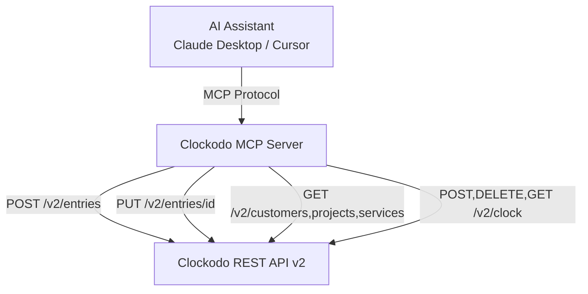
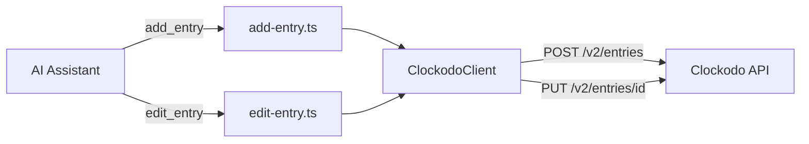
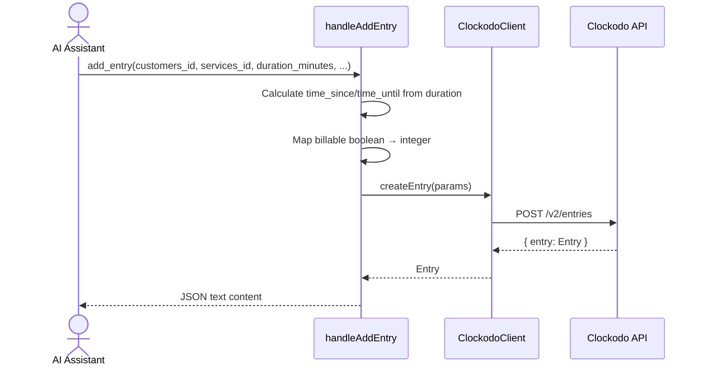
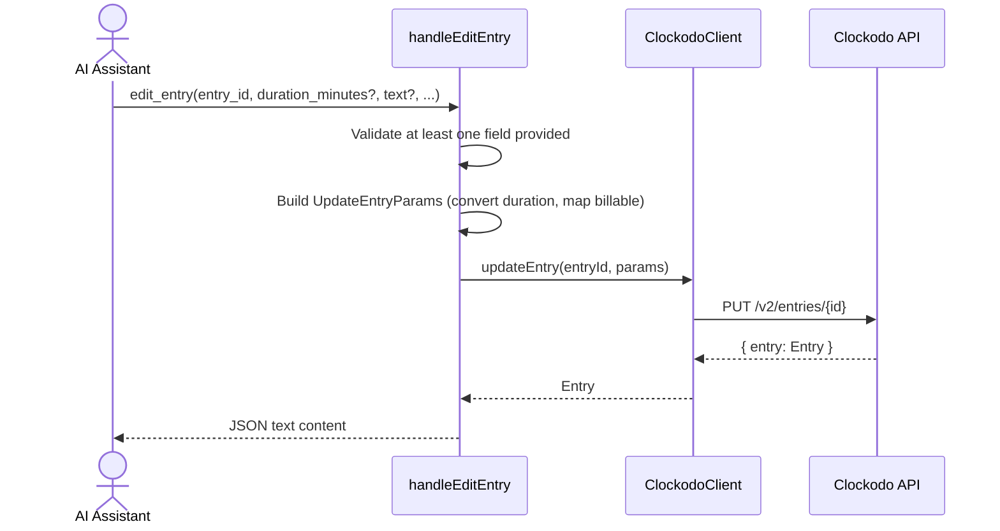

# Solution Design Document

## Validation Checklist

### CRITICAL GATES (Must Pass)

- [x] All required sections are complete
- [x] No [NEEDS CLARIFICATION] markers remain
- [x] Architecture pattern is clearly stated with rationale
- [x] **All architecture decisions confirmed by user**
- [x] Every interface has specification

### QUALITY CHECKS (Should Pass)

- [x] All context sources are listed with relevance ratings
- [x] Project commands are discovered from actual project files
- [x] Constraints → Strategy → Design → Implementation path is logical
- [x] Every component in diagram has directory mapping
- [x] Error handling covers all error types
- [x] Quality requirements are specific and measurable
- [x] Component names consistent across diagrams
- [x] A developer could implement from this design
- [x] Implementation examples use actual schema column names (not pseudocode), verified against migration files
- [x] Complex queries include traced walkthroughs with example data showing how the logic evaluates

---

## Output Schema

### SDD Status Report

| Field | Type | Required | Description |
|-------|------|----------|-------------|
| specId | string | Yes | Spec identifier (NNN-name format) |
| architecture | ArchitectureSummary | Yes | Architecture overview |
| sections | SectionStatus[] | Yes | Status of each SDD section |
| adrs | ADRStatus[] | Yes | Architecture decision statuses |
| validationPassed | number | Yes | Validation items passed |
| validationPending | number | Yes | Validation items pending |
| nextSteps | string[] | Yes | Recommended next actions |

### ArchitectureSummary

| Field | Type | Required | Description |
|-------|------|----------|-------------|
| pattern | string | Yes | Selected architecture pattern |
| keyComponents | string[] | Yes | Main system components |
| externalIntegrations | string[] | No | External services integrated |

### SectionStatus

| Field | Type | Required | Description |
|-------|------|----------|-------------|
| name | string | Yes | Section name |
| status | enum: `COMPLETE`, `NEEDS_DECISION`, `IN_PROGRESS` | Yes | Current state |
| detail | string | No | What decision is needed or what's in progress |

### ADRStatus

| Field | Type | Required | Description |
|-------|------|----------|-------------|
| id | string | Yes | ADR identifier (e.g., ADR-1) |
| name | string | Yes | Decision name |
| status | enum: `CONFIRMED`, `PENDING` | Yes | Confirmation state |

---

## Constraints

CON-1: TypeScript with Node.js runtime. Must follow existing project conventions (strict mode, ES2022 target, Node16 modules).
CON-2: Must use the MCP SDK `server.tool()` registration pattern with Zod schemas for input validation.
CON-3: Must use the existing `ClockodoClient` class for all API communication. Authentication is already handled.

## Implementation Context

### Required Context Sources

#### Documentation Context
```yaml
- doc: .start/specs/001-clockodo-mcp-server/solution.md
  relevance: HIGH
  why: "Established architecture patterns and conventions for the MCP server"

- doc: .start/specs/002-add-edit-time-entries/requirements.md
  relevance: HIGH
  why: "PRD defining what needs to be built"
```

#### Code Context
```yaml
- file: src/clockodo-client.ts
  relevance: HIGH
  why: "API client where new methods createEntry and updateEntry will be added"

- file: src/tools/start-clock.ts
  relevance: HIGH
  why: "Most similar existing tool pattern — POST to Clockodo API with params"

- file: src/tools/stop-clock.ts
  relevance: MEDIUM
  why: "Similar pattern for single-entity operations (by ID)"

- file: src/index.ts
  relevance: MEDIUM
  why: "Tool registration entry point"

- file: package.json
  relevance: LOW
  why: "No new dependencies needed"
```

#### External APIs
```yaml
- service: Clockodo REST API v2
  doc: https://www.clockodo.com/en/api/
  relevance: HIGH
  why: "POST /v2/entries and PUT /v2/entries/{id} endpoints for entry CRUD"
```

### Implementation Boundaries

- **Must Preserve**: All existing tools (list-customers, list-projects, list-services, start-clock, stop-clock, get-running-entry), existing `Entry` interface shape, existing `ClockodoClient` public API
- **Can Modify**: `ClockodoClient` class (add new methods), `Entry` interface (add `billable` field), `src/index.ts` (add new tool registrations)
- **Must Not Touch**: Cache implementation, existing tool handler logic, authentication mechanism

### External Interfaces

#### System Context Diagram



#### Interface Specifications

```yaml
# Inbound Interfaces
inbound:
  - name: "MCP Tool: add_entry"
    type: MCP Protocol (stdio)
    format: JSON-RPC
    authentication: None (MCP server is local)
    data_flow: "AI assistant sends entry creation request"

  - name: "MCP Tool: edit_entry"
    type: MCP Protocol (stdio)
    format: JSON-RPC
    authentication: None (MCP server is local)
    data_flow: "AI assistant sends entry update request"

# Outbound Interfaces
outbound:
  - name: "Clockodo REST API v2 - Entries"
    type: HTTPS
    format: REST/JSON
    authentication: X-ClockodoApiUser + X-ClockodoApiKey headers
    data_flow: "Create and update time entries"
    criticality: HIGH
```

### Project Commands

```bash
# Core Commands (from package.json)
Install: pnpm install
Dev:     pnpm run dev        # tsx watch src/index.ts
Test:    pnpm test            # vitest
Lint:    pnpm run lint        # eslint src
Build:   pnpm run build       # tsc
Typecheck: pnpm run typecheck # tsc --noEmit
```

## Solution Strategy

- **Architecture Pattern**: Modular tool pattern — each MCP tool is a self-contained module with a handler function (testable) and a register function (wiring). This extends the existing pattern with two new modules.
- **Integration Approach**: Add `createEntry()` and `updateEntry()` methods to the existing `ClockodoClient` class, then create two new tool modules that use these methods.
- **Justification**: The codebase already has 6 tools following this exact pattern. Consistency reduces cognitive load and ensures the same test patterns apply.
- **Key Decisions**: Duration input in minutes (user-friendly) converted to `time_since`/`time_until` (API-required). Billable defaults to `true`. No caching for write operations.

## Building Block View

### Components



### Directory Map

**Component**: Clockodo MCP Server
```
src/
├── clockodo-client.ts          # MODIFY: Add createEntry(), updateEntry(), new types
├── clockodo-client.test.ts     # MODIFY: Add tests for new methods
├── index.ts                    # MODIFY: Register add_entry and edit_entry tools
└── tools/
    ├── add-entry.ts            # NEW: handleAddEntry + registerAddEntry
    ├── add-entry.test.ts       # NEW: Tests for add_entry tool
    ├── edit-entry.ts           # NEW: handleEditEntry + registerEditEntry
    └── edit-entry.test.ts      # NEW: Tests for edit_entry tool
```

### Interface Specifications

#### Application Data Models

```typescript
// Added to ClockodoClient (src/clockodo-client.ts)

// Existing Entry interface — add billable field
interface Entry {
  id: number;
  customers_id: number;
  projects_id: number | null;
  services_id: number;
  text: string | null;
  time_since: string;
  time_until: string | null;
  duration: number;
  billable: number;           // NEW: 0 = not billable, 1 = billable
}

// New param interfaces
interface CreateEntryParams {
  customers_id: number;
  services_id: number;
  billable: number;           // 0 or 1
  time_since: string;         // ISO 8601 UTC
  time_until: string;         // ISO 8601 UTC
  projects_id?: number;
  text?: string;
}

interface UpdateEntryParams {
  customers_id?: number;
  services_id?: number;
  projects_id?: number;
  billable?: number;          // 0 or 1
  duration?: number;          // seconds
  text?: string;
}
```

#### MCP Tool Schemas

**add_entry tool input schema (Zod):**

| Field | Type | Required | Validation | Description |
|-------|------|----------|------------|-------------|
| `customers_id` | number | Yes | `.int().min(1)` | Customer ID |
| `services_id` | number | Yes | `.int().min(1)` | Service ID |
| `duration_minutes` | number | Yes | `.int().min(0)` | Duration in minutes |
| `projects_id` | number | No | `.int().min(1)` | Project ID |
| `text` | string | No | `.max(1000)` | Entry description |
| `billable` | boolean | No | default `true` | Whether entry is billable |

**edit_entry tool input schema (Zod):**

| Field | Type | Required | Validation | Description |
|-------|------|----------|------------|-------------|
| `entry_id` | number | Yes | `.int().min(1)` | Entry ID to update |
| `customers_id` | number | No | `.int().min(1)` | New customer ID |
| `services_id` | number | No | `.int().min(1)` | New service ID |
| `projects_id` | number | No | `.int().min(1)` | New project ID |
| `duration_minutes` | number | No | `.int().min(0)` | New duration in minutes |
| `text` | string | No | `.max(1000)` | New description |
| `billable` | boolean | No | | New billable status |

#### Internal API Changes

```yaml
# New ClockodoClient methods
Method: createEntry(params: CreateEntryParams)
  HTTP: POST /v2/entries
  Request Body: CreateEntryParams as JSON
  Response: { entry: Entry }
  Caching: Never
  Notes: time_since and time_until are calculated by the tool handler, not the client

Method: updateEntry(entryId: number, params: UpdateEntryParams)
  HTTP: PUT /v2/entries/{entryId}
  Request Body: UpdateEntryParams as JSON (only changed fields)
  Response: { entry: Entry }
  Caching: Never
```

### Implementation Examples

#### Example: Duration-to-Time-Window Conversion in add-entry handler

**Why this example**: The conversion from user-friendly `duration_minutes` to API-required `time_since`/`time_until` is the key business logic in the add_entry handler. This clarifies the calculation and billable mapping.

```typescript
// In handleAddEntry (src/tools/add-entry.ts)
export async function handleAddEntry(
  client: ClockodoClient,
  args: {
    customers_id: number;
    services_id: number;
    duration_minutes: number;
    projects_id?: number;
    text?: string;
    billable?: boolean;
  },
) {
  const timeUntil = new Date();
  const timeSince = new Date(timeUntil.getTime() - args.duration_minutes * 60 * 1000);

  const entry = await client.createEntry({
    customers_id: args.customers_id,
    services_id: args.services_id,
    billable: args.billable === false ? 0 : 1,  // default true → 1
    time_since: timeSince.toISOString(),
    time_until: timeUntil.toISOString(),
    projects_id: args.projects_id,
    text: args.text,
  });

  return {
    content: [{ type: "text" as const, text: JSON.stringify(entry, null, 2) }],
  };
}
```

#### Example: Validation in edit-entry handler

**Why this example**: The edit handler must validate that at least one field is provided beyond `entry_id`, and convert `duration_minutes` to seconds before sending to the API.

```typescript
// In handleEditEntry (src/tools/edit-entry.ts)
export async function handleEditEntry(
  client: ClockodoClient,
  args: {
    entry_id: number;
    customers_id?: number;
    services_id?: number;
    projects_id?: number;
    duration_minutes?: number;
    text?: string;
    billable?: boolean;
  },
) {
  const params: UpdateEntryParams = {};

  if (args.customers_id !== undefined) params.customers_id = args.customers_id;
  if (args.services_id !== undefined) params.services_id = args.services_id;
  if (args.projects_id !== undefined) params.projects_id = args.projects_id;
  if (args.text !== undefined) params.text = args.text;
  if (args.duration_minutes !== undefined) params.duration = args.duration_minutes * 60;
  if (args.billable !== undefined) params.billable = args.billable ? 1 : 0;

  if (Object.keys(params).length === 0) {
    return {
      content: [{ type: "text" as const, text: "Error: At least one field must be provided to update." }],
      isError: true,
    };
  }

  const entry = await client.updateEntry(args.entry_id, params);

  return {
    content: [{ type: "text" as const, text: JSON.stringify(entry, null, 2) }],
  };
}
```

#### Example: ClockodoClient.createEntry method

**Why this example**: Shows the client method pattern consistent with existing `startClock`.

```typescript
// In ClockodoClient (src/clockodo-client.ts)
async createEntry(params: CreateEntryParams): Promise<Entry> {
  const response = await this.request("/v2/entries", {
    method: "POST",
    body: JSON.stringify(params),
  });
  const body = await response.json();
  return body.entry as Entry;
}

async updateEntry(entryId: number, params: UpdateEntryParams): Promise<Entry> {
  const response = await this.request(`/v2/entries/${entryId}`, {
    method: "PUT",
    body: JSON.stringify(params),
  });
  const body = await response.json();
  return body.entry as Entry;
}
```

## Runtime View

### Primary Flow: Add Entry

1. AI assistant calls `add_entry` with `customers_id`, `services_id`, `duration_minutes`, optional `projects_id`, `text`, `billable`
2. Handler calculates `time_until = now`, `time_since = now - duration`
3. Handler maps `billable` boolean to API integer (true→1, false→0, default→1)
4. Handler calls `client.createEntry(params)`
5. Client sends `POST /v2/entries` with JSON body
6. Clockodo returns `{ entry: Entry }`
7. Handler returns the entry as JSON text content



### Secondary Flow: Edit Entry

1. AI assistant calls `edit_entry` with `entry_id` and one or more optional fields
2. Handler validates at least one field is provided
3. Handler converts `duration_minutes` to seconds if provided
4. Handler maps `billable` boolean to integer if provided
5. Handler calls `client.updateEntry(entryId, params)`
6. Client sends `PUT /v2/entries/{id}` with only the changed fields
7. Handler returns the updated entry



### Error Handling

- **Invalid input (Zod validation)**: MCP SDK returns validation error automatically before handler is called
- **Invalid customer/service/project ID**: Clockodo API returns 4xx → `ClockodoApiError` thrown → handler catches and returns `isError: true` with error message
- **Invalid entry ID (edit)**: Clockodo API returns 404 → same error path
- **No fields provided (edit)**: Handler returns validation error before calling API
- **Network failure**: `fetch` throws → `ClockodoClient.request()` propagates → handler catches generic error

## Deployment View

No change to existing deployment. The new tools are registered in `src/index.ts` alongside existing tools. No new environment variables, no new dependencies, no configuration changes.

## Cross-Cutting Concepts

### System-Wide Patterns

- **Security**: Same authentication as existing tools (X-ClockodoApiUser + X-ClockodoApiKey headers). No new secrets needed.
- **Error Handling**: Same try/catch pattern as existing tools. Errors wrapped in `{ content: [{ type: "text", text: "Error: ..." }], isError: true }`.
- **Performance**: No caching for write operations. No batching needed (single entry per call).

## Architecture Decisions

- [x] **ADR-1: Follow existing tool pattern (handler + register)** — Consistency with all 6 existing tools. Trade-off: None.
  - User confirmed: Yes

- [x] **ADR-2: Duration input in minutes, convert to time window** — Matches user mental model. Trade-off: Time anchored to "now" by default (custom start time is Could Have).
  - User confirmed: Yes

- [x] **ADR-3: Extend Entry interface, add CreateEntryParams and UpdateEntryParams** — Minimal type additions. Trade-off: Adding `billable` to existing Entry may surface in existing tool responses.
  - User confirmed: Yes

- [x] **ADR-4: No caching for write operations** — Writes must always reach the API. Trade-off: None.
  - User confirmed: Yes

## Quality Requirements

- **Performance**: Entry creation and update should complete within 2 seconds (bounded by Clockodo API latency). No local computation bottlenecks.
- **Reliability**: Errors from the Clockodo API are propagated with clear messages. No silent failures.
- **Security**: No new attack surface — all inputs validated by Zod schemas, all API calls use existing authenticated client.
- **Testability**: Handlers are pure functions (given mocked client) — same test pattern as existing tools.

## Acceptance Criteria

**Main Flow Criteria:**
- [x] WHEN the AI assistant calls `add_entry` with valid `customers_id`, `services_id`, and `duration_minutes`, THE SYSTEM SHALL create a completed entry in Clockodo and return the entry details
- [x] WHEN the AI assistant calls `edit_entry` with a valid `entry_id` and at least one changed field, THE SYSTEM SHALL update the entry and return the updated details
- [x] WHEN `billable` is not provided to `add_entry`, THE SYSTEM SHALL default to billable (1)

**Error Handling Criteria:**
- [x] WHEN Clockodo API returns a 4xx/5xx error, THE SYSTEM SHALL return `isError: true` with the error message
- [x] WHEN `edit_entry` is called with no fields besides `entry_id`, THE SYSTEM SHALL return a validation error before calling the API
- [x] IF `duration_minutes` is provided, THEN THE SYSTEM SHALL convert to seconds (×60) before sending to the API

**Edge Case Criteria:**
- [x] WHEN `duration_minutes` is 0, THE SYSTEM SHALL create an entry with 0 duration (time_since = time_until)
- [x] WHEN `billable` is explicitly false, THE SYSTEM SHALL send billable=0 to the API

## Risks and Technical Debt

### Known Technical Issues

None. The existing codebase is clean with no known bugs affecting this feature.

### Technical Debt

- The existing `Entry` interface does not include `billable`. Adding it is necessary but means existing tool responses (start-clock, stop-clock, get-running-entry) will now also include the `billable` field if returned by the API. This is acceptable — it's additional information, not a breaking change.

### Implementation Gotchas

- The Clockodo `POST /v2/entries` endpoint requires `billable` as a number (0 or 1), not a boolean. The tool schema exposes it as a boolean for user-friendliness, and the handler converts it.
- The `PUT /v2/entries/{id}` endpoint accepts `duration` in seconds directly, while `POST /v2/entries` requires `time_since` and `time_until`. The create and update paths have different parameter shapes.
- ISO 8601 timestamps must include timezone. Use `new Date().toISOString()` which produces UTC format (e.g., `"2026-03-05T14:30:00.000Z"`).

## Glossary

### Domain Terms

| Term | Definition | Context |
|------|------------|---------|
| Entry | A completed time record in Clockodo with start/end time, customer, service, and description | Core entity being created/updated |
| Clock | A running stopwatch in Clockodo (real-time tracking) | Existing feature — distinct from entries |
| Billable | Whether a time entry can be invoiced to the customer | Required field when creating entries |
| Service (Leistung) | A category of work performed (e.g., "interne Arbeitszeit") | Required reference for entries |

### Technical Terms

| Term | Definition | Context |
|------|------------|---------|
| MCP | Model Context Protocol — standard for AI assistant tool integration | Communication protocol between AI and this server |
| Handler | Pure async function that implements tool logic | `handleAddEntry`, `handleEditEntry` |
| Register | Function that wires a handler to the MCP server with schema | `registerAddEntry`, `registerEditEntry` |

### API Terms

| Term | Definition | Context |
|------|------------|---------|
| `time_since` | Entry start time as ISO 8601 UTC string | Calculated from `now - duration` |
| `time_until` | Entry end time as ISO 8601 UTC string | Set to current time for new entries |
| `duration` | Entry duration in seconds (API format) | Converted from `duration_minutes × 60` |
| `billable` | Integer enum: 0=NotBillable, 1=Billable | Mapped from boolean in tool schema |
