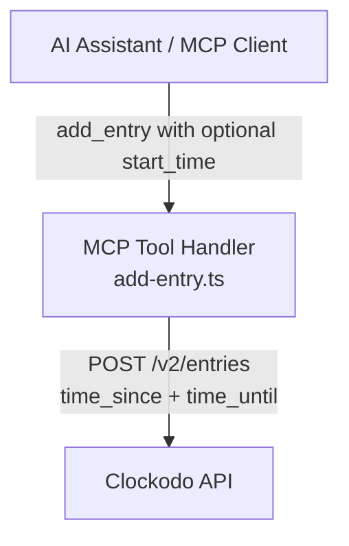
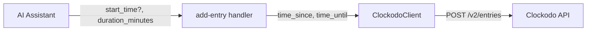
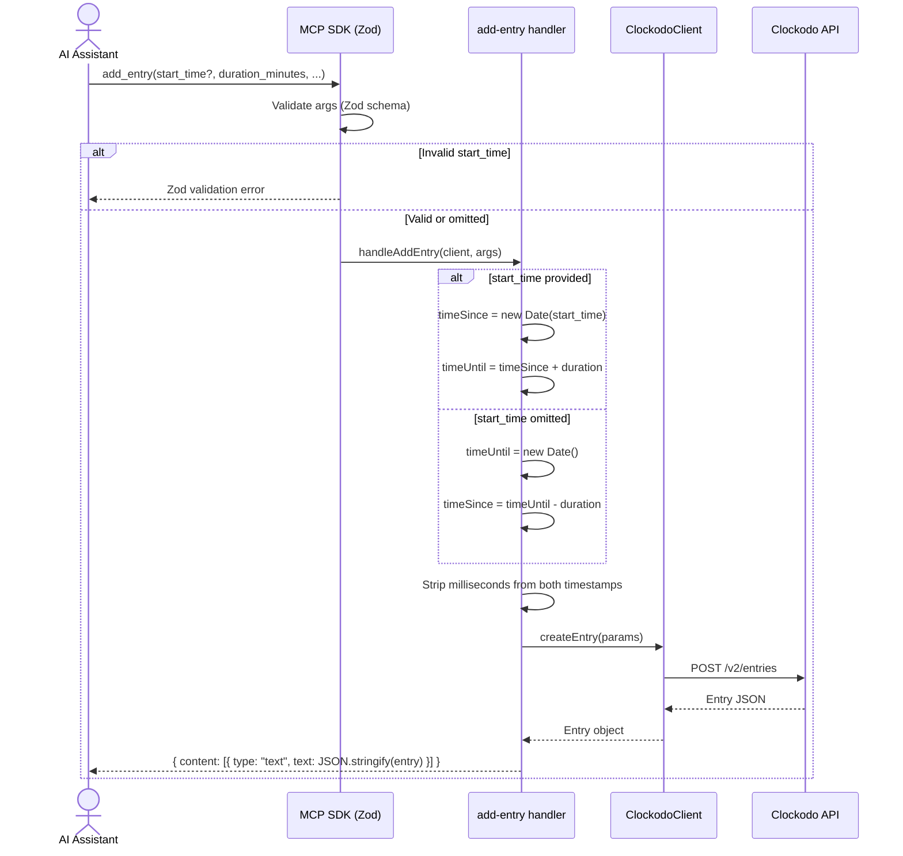

# Solution Design Document

## Validation Checklist

### CRITICAL GATES (Must Pass)

- [x] All required sections are complete
- [x] No [NEEDS CLARIFICATION] markers remain
- [x] Architecture pattern is clearly stated with rationale
- [x] **All architecture decisions confirmed by user**
- [x] Every interface has specification

### QUALITY CHECKS (Should Pass)

- [x] All context sources are listed with relevance ratings
- [x] Project commands are discovered from actual project files
- [x] Constraints → Strategy → Design → Implementation path is logical
- [x] Every component in diagram has directory mapping
- [x] Error handling covers all error types
- [x] Quality requirements are specific and measurable
- [x] Component names consistent across diagrams
- [x] A developer could implement from this design
- [x] Implementation examples use actual schema column names (not pseudocode), verified against migration files
- [x] Complex queries include traced walkthroughs with example data showing how the logic evaluates

---

## Constraints

CON-1 **Language/Runtime**: TypeScript, Node.js, MCP SDK, Zod for schema validation.
CON-2 **API Format**: Clockodo API requires `time_since` and `time_until` as ISO 8601 UTC strings without milliseconds (e.g., `"2026-03-05T09:00:00Z"`).
CON-3 **Backward Compatibility**: Existing `add_entry` behavior must be preserved exactly when `start_time` is not provided.

## Implementation Context

### Required Context Sources

#### Code Context
```yaml
- file: src/tools/add-entry.ts
  relevance: HIGH
  why: "Primary file to modify — handler logic and Zod schema"

- file: src/tools/add-entry.test.ts
  relevance: HIGH
  why: "Test file to extend with new test cases"

- file: src/clockodo-client.ts
  relevance: MEDIUM
  why: "CreateEntryParams interface — no changes needed, confirms time_since/time_until accept strings"

- file: src/tools/edit-entry.ts
  relevance: LOW
  why: "Reference for optional parameter pattern (conditional forwarding)"
```

### Implementation Boundaries

- **Must Preserve**: Existing behavior when `start_time` is omitted. All existing tests must continue to pass unchanged.
- **Can Modify**: `src/tools/add-entry.ts` (handler logic + Zod schema).
- **Must Not Touch**: `src/clockodo-client.ts`, `src/tools/edit-entry.ts`, or any other tool handlers.

### External Interfaces



#### Interface Specifications

```yaml
inbound:
  - name: "MCP Tool Call"
    type: JSON-RPC
    format: MCP SDK tool call
    authentication: N/A (local process)
    data_flow: "AI assistant sends structured args to add_entry tool"

outbound:
  - name: "Clockodo REST API"
    type: HTTPS
    format: REST (POST /v2/entries)
    authentication: API Key + Email (handled by ClockodoClient)
    data_flow: "CreateEntryParams with time_since, time_until, customers_id, services_id, billable"
```

### Project Commands

```bash
Install: npm install
Dev:     npm run dev
Test:    npm test
Lint:    npm run lint
Build:   npm run build
Typecheck: npm run typecheck
```

## Solution Strategy

- **Architecture Pattern**: Layered — MCP tool handler (presentation) → ClockodoClient (integration). Only the handler layer changes.
- **Integration Approach**: Add an optional `start_time` parameter to the existing `add_entry` tool. The handler conditionally uses it to compute `time_since`/`time_until` instead of `new Date()`.
- **Justification**: Minimal change surface. The ClockodoClient already accepts arbitrary ISO strings for `time_since`/`time_until`, so the feature is entirely a handler-level concern.
- **Key Decisions**: `start_time` is an optional ISO 8601 datetime string. When provided, `time_since = start_time` and `time_until = start_time + duration_minutes`. When absent, current behavior preserved.

## Building Block View

### Components



| Component | Role | Change |
|-----------|------|--------|
| **Tool Handler** (`src/tools/add-entry.ts`) | Validates inputs, computes time window, calls API client | MODIFY |
| **Zod Schema** (within `add-entry.ts`) | Defines MCP tool parameters | MODIFY |
| **ClockodoClient** (`src/clockodo-client.ts`) | Sends HTTP requests to Clockodo API | NO CHANGE |

### Directory Map

```
.
├── src/
│   └── tools/
│       ├── add-entry.ts       # MODIFY: Add start_time param + conditional time logic
│       └── add-entry.test.ts  # MODIFY: Add test cases for start_time scenarios
```

### Interface Specifications

#### MCP Tool Schema Change

Current schema:
```yaml
add_entry:
  customers_id: z.number().int().min(1)         # required
  services_id: z.number().int().min(1)           # required
  duration_minutes: z.number().int().min(0)      # required
  projects_id: z.number().int().min(1).optional()
  text: z.string().max(1000).optional()
  billable: z.boolean().optional()
```

New schema (additions only):
```yaml
add_entry:
  # ... existing params unchanged ...
  start_time: z.string().datetime({ offset: true }).optional()
    .describe("Entry start time as ISO 8601 (e.g. '2026-03-06T10:00:00Z' or '2026-03-06T10:00:00+01:00'). Defaults to now minus duration if omitted.")
```

The `z.string().datetime({ offset: true })` Zod validator accepts both UTC (`Z`) and offset-aware (`+01:00`) ISO 8601 strings. Invalid strings are rejected at the schema level before the handler runs.

#### Data Storage Changes

No database or storage changes. The Clockodo API is the persistence layer.

#### Application Data Models

No changes to `CreateEntryParams` or `Entry` interfaces in `clockodo-client.ts`.

The handler's `args` type gains one optional field:
```typescript
args: {
  // ... existing fields ...
  start_time?: string;  // NEW: ISO 8601 datetime
}
```

### Implementation Examples

#### Example: Time Window Calculation Logic

**Why this example**: The conditional branching between "custom start" and "default now" is the core business logic change. This clarifies the exact calculation for both paths.

```typescript
function formatTimestamp(date: Date): string {
  return date.toISOString().replace(/\.\d{3}Z$/, "Z");
}

// Path A: Custom start_time provided
// start_time = "2026-03-06T10:00:00+01:00", duration_minutes = 30
const timeSince = new Date("2026-03-06T10:00:00+01:00");
// timeSince internal: 2026-03-06T09:00:00.000Z (UTC normalized by Date constructor)
const timeUntil = new Date(timeSince.getTime() + 30 * 60 * 1000);
// timeUntil internal: 2026-03-06T09:30:00.000Z

// Sent to API:
// time_since: "2026-03-06T09:00:00Z"  (offset normalized to UTC, ms stripped)
// time_until: "2026-03-06T09:30:00Z"

// Path B: No start_time (existing behavior, unchanged)
// duration_minutes = 30, current time = 2026-03-05T14:00:00.000Z
const timeUntil = new Date(); // 2026-03-05T14:00:00.000Z
const timeSince = new Date(timeUntil.getTime() - 30 * 60 * 1000);
// timeSince: 2026-03-05T13:30:00.000Z

// Sent to API:
// time_since: "2026-03-05T13:30:00Z"
// time_until: "2026-03-05T14:00:00Z"
```

**Traced Walkthrough — Midnight Crossover:**
```
Input:  start_time = "2026-03-05T23:45:00Z", duration_minutes = 30
Step 1: timeSince = new Date("2026-03-05T23:45:00Z")  → 2026-03-05T23:45:00.000Z
Step 2: timeUntil = timeSince + 30min                  → 2026-03-06T00:15:00.000Z
Step 3: formatTimestamp(timeSince)                      → "2026-03-05T23:45:00Z"
Step 4: formatTimestamp(timeUntil)                      → "2026-03-06T00:15:00Z"
Result: Entry spans two calendar days. API receives valid timestamps.
```

**Traced Walkthrough — Zero Duration:**
```
Input:  start_time = "2026-03-06T10:00:00Z", duration_minutes = 0
Step 1: timeSince = new Date("2026-03-06T10:00:00Z")  → 2026-03-06T10:00:00.000Z
Step 2: timeUntil = timeSince + 0min                   → 2026-03-06T10:00:00.000Z
Step 3: formatTimestamp(timeSince)                      → "2026-03-06T10:00:00Z"
Step 4: formatTimestamp(timeUntil)                      → "2026-03-06T10:00:00Z"
Result: time_since = time_until. Zero-duration entry at specified time.
```

#### Test Examples as Interface Documentation

```typescript
describe("handleAddEntry() with start_time", () => {
  it("uses start_time as time_since and calculates time_until", async () => {
    const client = makeClient({
      createEntry: vi.fn().mockResolvedValue(baseEntry),
    });

    await handleAddEntry(client, {
      customers_id: 1,
      services_id: 2,
      duration_minutes: 30,
      start_time: "2026-03-06T10:00:00Z",
    });

    expect(client.createEntry).toHaveBeenCalledWith({
      customers_id: 1,
      services_id: 2,
      billable: 1,
      time_since: "2026-03-06T10:00:00Z",
      time_until: "2026-03-06T10:30:00Z",
    });
  });

  it("normalizes timezone offset to UTC", async () => {
    const client = makeClient({
      createEntry: vi.fn().mockResolvedValue(baseEntry),
    });

    await handleAddEntry(client, {
      customers_id: 1,
      services_id: 2,
      duration_minutes: 30,
      start_time: "2026-03-06T10:00:00+01:00",
    });

    expect(client.createEntry).toHaveBeenCalledWith(
      expect.objectContaining({
        time_since: "2026-03-06T09:00:00Z",
        time_until: "2026-03-06T09:30:00Z",
      }),
    );
  });

  it("preserves default behavior when start_time is not provided", async () => {
    // Uses vi.useFakeTimers() to pin new Date()
    const client = makeClient({
      createEntry: vi.fn().mockResolvedValue(baseEntry),
    });

    await handleAddEntry(client, {
      customers_id: 1,
      services_id: 2,
      duration_minutes: 60,
    });

    // Existing assertions unchanged — time_until = now, time_since = now - 60min
    expect(client.createEntry).toHaveBeenCalledWith(
      expect.objectContaining({
        time_since: "2026-03-05T09:00:00Z",
        time_until: "2026-03-05T10:00:00Z",
      }),
    );
  });
});
```

## Runtime View

### Primary Flow

#### Flow A: Custom Start Time

1. AI assistant resolves user's natural language ("log 30 min from 10:00 to 10:30 today") to `start_time = "2026-03-05T10:00:00+01:00"` and `duration_minutes = 30`.
2. MCP SDK validates args against Zod schema (including `z.string().datetime({ offset: true })`).
3. Handler computes: `timeSince = new Date(start_time)`, `timeUntil = timeSince + duration`.
4. Handler strips milliseconds and calls `client.createEntry(...)`.
5. Clockodo API creates the entry and returns the `Entry` object.
6. Handler returns JSON response to MCP client.

#### Flow B: Default (No Start Time)

1. Existing flow unchanged. `timeUntil = new Date()`, `timeSince = timeUntil - duration`.



### Error Handling

| Error Type | Source | Handling |
|------------|--------|----------|
| Invalid `start_time` format | Zod schema validation | Rejected before handler. MCP SDK returns Zod error to AI assistant. |
| Future-dated entry rejected by API | Clockodo API 400 | Handler catches error, returns `{ isError: true, content: "Error: ..." }`. |
| Network failure | ClockodoClient | Handler catches error, returns `{ isError: true, content: "Error: ..." }`. |
| API rejects `time_since >= time_until` | Clockodo API 400 | Only possible with `duration_minutes = 0`. Passed through; error returned if API rejects. |

## Deployment View

No change to existing deployment. The feature is a code-only change to `src/tools/add-entry.ts`. No new dependencies, no environment variables, no configuration changes. Rebuild with `npm run build` picks up the change.

## Cross-Cutting Concepts

### Pattern Documentation

```yaml
- pattern: Millisecond stripping (.toISOString().replace(/\.\d{3}Z$/, "Z"))
  relevance: HIGH
  why: "Clockodo API rejects timestamps with milliseconds. Pattern established in add-entry.ts and must be applied to user-supplied start_time as well."

- pattern: Optional parameter with conditional logic
  relevance: MEDIUM
  why: "Same pattern used in edit-entry.ts for optional field forwarding. start_time follows this convention."
```

### User Interface & UX

Not applicable. This is an MCP tool with no UI. The AI assistant handles natural language interaction.

### System-Wide Patterns

- **Error Handling**: Existing try/catch in handler already returns `{ isError: true }`. No change needed.
- **Security**: No new attack surface. `start_time` is validated by Zod and parsed by the standard `Date` constructor. No user input reaches the API unsanitized.

## Architecture Decisions

- [x] **ADR-1 — Parameter name `start_time`**: Use `start_time` as the parameter name (ISO 8601 datetime string, optional).
  - Rationale: Matches the PRD Feature 4 naming. Descriptive and unambiguous. Consistent with `time_since` semantics in the Clockodo API.
  - Trade-offs: Users must provide a full datetime, not just a time — the AI model handles this conversion.
  - User confirmed: **Yes**

- [x] **ADR-2 — UTC normalization via `new Date()`**: Parse user-supplied `start_time` with `new Date(input)` which normalizes any timezone offset to UTC.
  - Rationale: The JavaScript `Date` constructor handles RFC 2822 and ISO 8601 strings, correctly converting offsets to UTC. `toISOString()` then produces a UTC `Z`-suffixed string. No external library needed.
  - Trade-offs: Relies on JavaScript's built-in date parsing, which is reliable for ISO 8601 but not for arbitrary formats. Zod's `datetime({ offset: true })` ensures only valid ISO strings reach the handler.
  - User confirmed: **Yes**

- [x] **ADR-3 — No changes to ClockodoClient**: The `CreateEntryParams` interface already accepts `time_since` and `time_until` as strings. No client modifications needed.
  - Rationale: Keeps the change surface minimal. The client is a thin HTTP wrapper and should not contain business logic about time anchoring.
  - Trade-offs: None — this is purely a scope reduction.
  - User confirmed: **Yes**

## Quality Requirements

- **Correctness**: Custom `start_time` entries must land at the exact specified time in Clockodo (verified by API response `time_since` field).
- **Backward Compatibility**: All existing tests pass without modification. Omitting `start_time` produces identical behavior to the current implementation.
- **Validation**: Invalid `start_time` strings are rejected at the Zod schema level before the handler executes.

## Acceptance Criteria

**Main Flow Criteria [ref: PRD Feature 1]:**
- [x] WHEN `start_time` is provided as a valid ISO 8601 string, THE SYSTEM SHALL set `time_since` to the provided `start_time` (normalized to UTC, milliseconds stripped) and `time_until` to `start_time + duration_minutes`
- [x] WHEN `start_time` is not provided, THE SYSTEM SHALL preserve existing behavior (`time_until = now`, `time_since = now - duration`)

**Timezone Criteria [ref: PRD Feature 1, AC3]:**
- [x] WHEN `start_time` includes a timezone offset (e.g., `+01:00`), THE SYSTEM SHALL normalize to UTC before sending to the Clockodo API

**Edge Case Criteria [ref: PRD Feature 1, AC4-AC5]:**
- [x] WHEN `start_time` and `duration_minutes` produce a `time_until` that crosses midnight, THE SYSTEM SHALL calculate both timestamps correctly without local rejection
- [x] WHEN `duration_minutes` is 0 and `start_time` is provided, THE SYSTEM SHALL create an entry with `time_since = time_until = start_time`

**Error Handling Criteria [ref: PRD Feature 1, AC from edge cases]:**
- [x] IF `start_time` is not a valid ISO 8601 string, THEN THE SYSTEM SHALL reject the input at the Zod schema level
- [x] IF the Clockodo API rejects a future-dated entry, THEN THE SYSTEM SHALL return the API error as `{ isError: true }`

## Risks and Technical Debt

### Known Technical Issues

- The millisecond-stripping regex (`/\.\d{3}Z$/`) is duplicated inline. A helper function (`formatTimestamp`) would reduce duplication, but is out of scope for this change to avoid unnecessary refactoring.

### Implementation Gotchas

- `z.string().datetime({ offset: true })` in Zod requires `zod >= 3.23.0`. Verify the installed version supports this option.
- `new Date("2026-03-06T10:00:00+01:00").toISOString()` produces `"2026-03-06T09:00:00.000Z"` — the offset is correctly absorbed. This is standard JavaScript behavior but worth verifying in tests.
- The existing tests use `vi.useFakeTimers()` to pin `new Date()`. New tests for `start_time` do NOT need fake timers (the input drives the output deterministically), but existing tests must remain unchanged.

## Glossary

### Domain Terms

| Term | Definition | Context |
|------|------------|---------|
| Time Entry | A recorded period of work in Clockodo with start time, end time, customer, and service | Core entity created by the `add_entry` tool |
| `time_since` | The start timestamp of a time entry (ISO 8601 UTC) | Clockodo API field, maps to `start_time` parameter |
| `time_until` | The end timestamp of a time entry (ISO 8601 UTC) | Clockodo API field, calculated from `start_time + duration_minutes` |

### Technical Terms

| Term | Definition | Context |
|------|------------|---------|
| MCP (Model Context Protocol) | Protocol for AI assistants to call structured tools | The transport layer for `add_entry` tool calls |
| ISO 8601 | International standard for date/time string representation | Required format for `start_time` parameter and Clockodo API timestamps |
| Zod | TypeScript-first schema validation library | Validates `start_time` format before handler execution |
