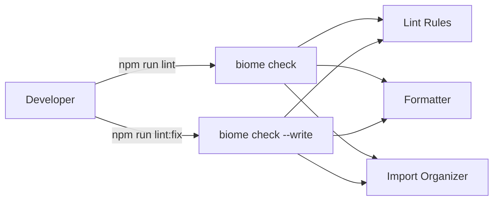

# Solution Design Document

## Validation Checklist

### CRITICAL GATES (Must Pass)

- [x] All required sections are complete
- [x] No [NEEDS CLARIFICATION] markers remain
- [x] Architecture pattern is clearly stated with rationale
- [x] **All architecture decisions confirmed by user**
- [x] Every interface has specification

### QUALITY CHECKS (Should Pass)

- [x] All context sources are listed with relevance ratings
- [x] Project commands are discovered from actual project files
- [x] Constraints → Strategy → Design → Implementation path is logical
- [x] Every component in diagram has directory mapping
- [x] Error handling covers all error types
- [x] Quality requirements are specific and measurable
- [x] Component names consistent across diagrams
- [x] A developer could implement from this design

---

## Constraints

CON-1 **Runtime**: Node.js with ESM (`"type": "module"`), TypeScript 5.7+, ES2022 target
CON-2 **Single dependency**: Replace ESLint entirely — do not keep both tools
CON-3 **Style preservation**: Match existing code style (double quotes, semicolons, 2-space indent, trailing commas)

## Implementation Context

### Required Context Sources

#### Code Context
```yaml
- file: package.json
  relevance: HIGH
  why: "Dependencies and scripts to modify"

- file: src/**/*.ts
  relevance: MEDIUM
  why: "Existing code style conventions to match in biome.json"
```

#### External Documentation
```yaml
- url: https://biomejs.dev/reference/configuration/
  relevance: HIGH
  why: "biome.json configuration reference"
```

### Implementation Boundaries

- **Must Preserve**: All existing npm scripts except `lint` (which will be replaced). `prepublishOnly` script chain.
- **Can Modify**: `lint` script, `devDependencies`, root config files
- **Must Not Touch**: `src/` application code (beyond formatting fixes applied by Biome)

### Project Commands

```bash
# Current Commands
Install: npm install
Dev:     npm run dev
Test:    npm test (vitest)
Lint:    npm run lint (BROKEN — eslint src, no config)
Build:   npm run build (tsc -p tsconfig.build.json)
Check:   npm run typecheck (tsc --noEmit)

# After Implementation
Lint:    npm run lint (biome check .)
Fix:     npm run lint:fix (biome check --write .)
```

## Solution Strategy

- **Architecture Pattern**: Tool replacement — swap one dev dependency for another with a single config file
- **Integration Approach**: Replace ESLint dev dependency with `@biomejs/biome`, add `biome.json` to project root, update npm scripts
- **Justification**: ESLint is installed but unconfigured (zero migration cost). Biome provides linting + formatting + import sorting in one tool. 10-25x faster execution.
- **Key Decisions**: Full replacement (not hybrid), exact version pinning, minimal script surface

## Building Block View

### Components



### Directory Map

```
.
├── biome.json              # NEW: Biome configuration
├── package.json            # MODIFY: Replace eslint with @biomejs/biome, update scripts
├── src/
│   └── **/*.ts             # MODIFY: Formatting fixes applied by biome check --write
```

### Interface Specifications

#### biome.json Configuration

```json
{
  "$schema": "https://biomejs.dev/schemas/2.0.6/schema.json",
  "vcs": {
    "enabled": true,
    "clientKind": "git",
    "useIgnoreFile": true
  },
  "files": {
    "ignoreUnknown": true
  },
  "formatter": {
    "enabled": true,
    "indentStyle": "space",
    "indentWidth": 2,
    "lineWidth": 100
  },
  "linter": {
    "enabled": true,
    "rules": {
      "recommended": true
    }
  },
  "organizeImports": {
    "enabled": true
  },
  "javascript": {
    "formatter": {
      "quoteStyle": "double",
      "trailingCommas": "all",
      "semicolons": "always"
    }
  }
}
```

**Configuration rationale:**
- `indentStyle: "space"` + `indentWidth: 2` — matches existing codebase convention
- `lineWidth: 100` — accommodates existing longer lines (some reach ~120 chars) while keeping code readable
- `quoteStyle: "double"` — matches existing codebase convention
- `trailingCommas: "all"` — matches existing codebase convention
- `semicolons: "always"` — matches existing codebase convention
- `vcs.useIgnoreFile: true` — respects `.gitignore` so `dist/`, `node_modules/` are excluded
- `files.ignoreUnknown: true` — skips file types Biome doesn't understand (avoids errors on non-supported files)
- `rules.recommended: true` — enables Biome's curated rule set (correctness, style, suspicious, performance)

#### package.json Changes

```yaml
# devDependencies
REMOVE: "eslint": "^9.0.0"
ADD:    "@biomejs/biome": "2.0.6"  # exact pin per ADR-1

# scripts
REPLACE: "lint": "eslint src"
WITH:    "lint": "biome check ."
ADD:     "lint:fix": "biome check --write ."
```

The `prepublishOnly` script (`npm run typecheck && npm test -- --run && npm run build`) does not reference `lint` and remains unchanged.

## Runtime View

### Primary Flow: Developer Runs Lint Check

1. Developer runs `npm run lint`
2. Biome reads `biome.json` configuration
3. Biome discovers all files (respecting `.gitignore` via VCS integration)
4. Biome runs linting, formatting check, and import organization check in parallel
5. Biome reports all issues to stdout with file paths, line numbers, and rule names
6. Exit code 0 if no issues, non-zero if issues found

### Primary Flow: Developer Auto-Fixes

1. Developer runs `npm run lint:fix`
2. Biome reads configuration and discovers files (same as above)
3. Biome applies safe fixes: formatting corrections, import reordering, safe lint fixes
4. Biome reports remaining issues that require manual attention
5. Modified files are written to disk

### Error Handling

- **Unknown file types**: Skipped silently (`ignoreUnknown: true`)
- **Parse errors**: Reported as errors with file path and location — does not crash the process
- **No files found**: Exits with code 0 (no issues)

## Deployment View

No change to deployment. Biome is a dev dependency only — it does not affect the built output (`dist/`), runtime behavior, or the published npm package.

## Cross-Cutting Concepts

### Pattern Documentation

This feature introduces no new application patterns. It is a developer tooling change only.

### System-Wide Patterns

- **Error Handling**: Biome exit codes align with standard CLI conventions (0 = success, non-zero = issues found)
- **Performance**: Biome runs in sub-second for this codebase size. No caching configuration needed.

## Architecture Decisions

- [x] **ADR-1 — Exact Version Pinning**: Pin `@biomejs/biome` to an exact version (no caret/tilde range)
  - Rationale: Biome recommends exact pinning because lint rule behavior can change between minor versions
  - Trade-offs: Requires manual version bumps for updates. Acceptable for a dev tool.
  - User confirmed: Yes

- [x] **ADR-2 — Minimal Script Surface**: Two scripts only: `lint` (check) and `lint:fix` (write)
  - Rationale: Keeps the interface simple. `biome check` already covers lint + format + imports. No need for separate `format` or `check` scripts.
  - Trade-offs: Less granular control. Developers who want format-only can run `npx biome format .` directly.
  - User confirmed: Yes

- [x] **ADR-3 — Include JSON Files**: Biome lints and formats JSON files (package.json, tsconfig.json, etc.)
  - Rationale: Low risk, high convenience. Ensures consistent JSON formatting across the project.
  - Trade-offs: Biome may reformat existing JSON files on first run. One-time change.
  - User confirmed: Yes

## Quality Requirements

- **Performance**: `npm run lint` completes in under 1 second for the entire codebase
- **Reliability**: `npm run lint` never fails with a configuration error (replacing the current broken state)
- **Usability**: Single command covers all code quality checks (lint + format + imports)

## Acceptance Criteria

**Main Flow Criteria:**
- [x] WHEN a developer runs `npm run lint`, THE SYSTEM SHALL check all source files for lint errors, formatting issues, and import order
- [x] WHEN a developer runs `npm run lint:fix`, THE SYSTEM SHALL auto-fix all safe issues and report remaining manual-fix items
- [x] THE SYSTEM SHALL exit with code 0 when no issues are found
- [x] THE SYSTEM SHALL exit with non-zero code when issues are found

**Configuration Criteria:**
- [x] THE SYSTEM SHALL use double quotes, semicolons, 2-space indentation, and trailing commas to match existing code style
- [x] THE SYSTEM SHALL respect `.gitignore` to exclude `dist/` and `node_modules/`
- [x] THE SYSTEM SHALL format JSON files in addition to TypeScript files

**Migration Criteria:**
- [x] WHEN implementation is complete, THE SYSTEM SHALL have zero ESLint dependencies remaining
- [x] THE SYSTEM SHALL not modify the `prepublishOnly` script behavior

## Risks and Technical Debt

### Known Technical Issues

- ESLint v9 is installed with no configuration — `npm run lint` currently fails. This SDD replaces ESLint entirely.

### Implementation Gotchas

- **First `biome check --write` run** will likely reformat many files (especially JSON files and any TypeScript files with minor style differences). This should be a single commit separate from the tooling change commit.
- **Biome version**: Use the latest stable 2.x release at time of implementation. The `$schema` URL in `biome.json` must match the installed version.

## Glossary

### Technical Terms

| Term | Definition | Context |
|------|------------|---------|
| Biome | A fast, unified toolchain for JavaScript/TypeScript linting, formatting, and import sorting | Replaces ESLint in this project |
| biome check | Biome CLI command that runs linting, formatting, and import organization in a single pass | Maps to `npm run lint` |
| ADR | Architecture Decision Record — a documented technical decision with rationale | Used to track confirmed decisions in this SDD |
